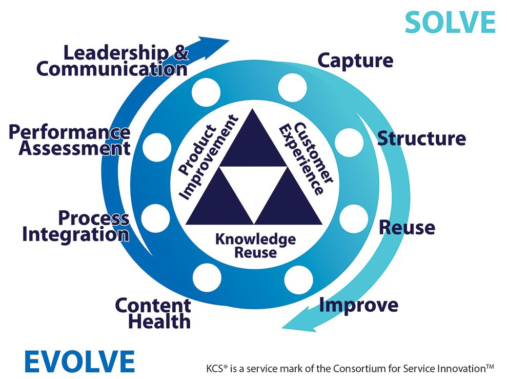

# Knowledge Base Redesign 
:::info[Focus]

KCS, Content Lifecycle, governance

:::
## 📋 CHALLENGE  

The global ServiceNow knowledge base had become unmanageable: duplicated content, outdated articles, inconsistent formats, and very poor findability. Support teams were losing significant time searching for reliable information.

## 🌐 LANGUAGES 

- 🇺🇸 English (global teams)
- 🇫🇷 French (local support teams)

## 🚀 TEAM
- 3 Technical Writers / Knowledge Managers (Public knowledge base)
- 3 Knowledge Managers (Internal knowledge base)

## 🎯 HOW WE HELPED 
- Conducted a full audit of the knowledge base: structure, content types, duplication, and usage patterns
- Designed a new taxonomy and content model tailored to ServiceNow, aligned with KCS principles
- Created authoring guidelines and templates to standardize contributions
- Defined a content lifecycle: creation, validation, publication, review, retirement
- Set up governance rules: ownership, review workflows, quality standards
- Facilitated workshops with global teams to onboard contributors and align practices
- Improved findability through metadata, tagging, and search optimization
- Collaborated with support, product, and KM stakeholders to ensure adoption and scalability

## 🖇️ Knowledge-Centered Service (KCS)

KCS enables machines to answer known questions while helping humans solve new problems.

 